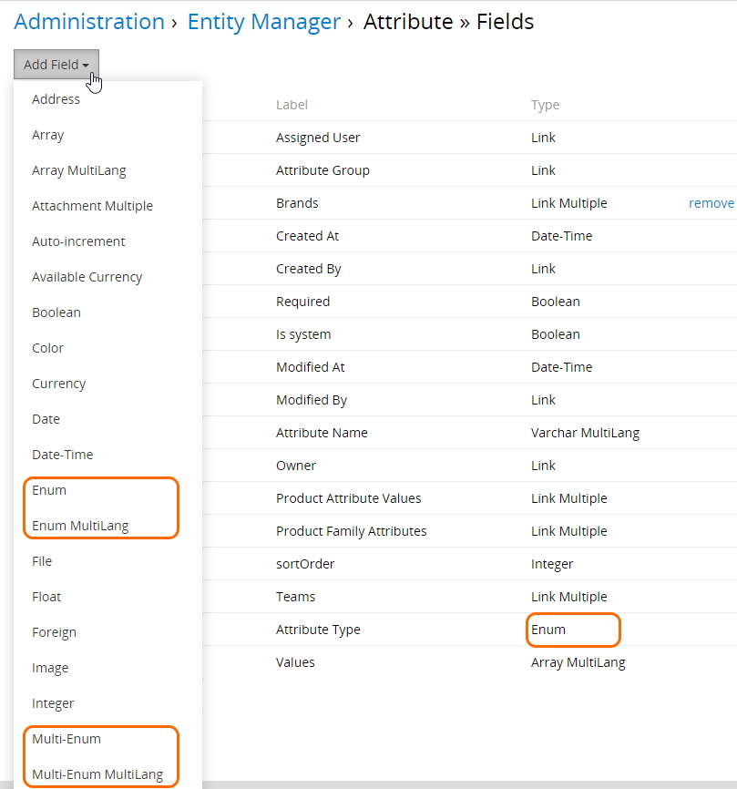
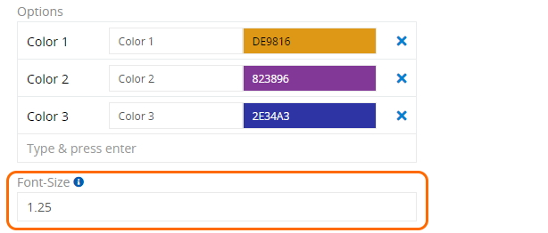

Das Modul ermöglicht es, die Werte der Feldtypen „Enum“ und „Multi-Enum“ farbig hervorzuheben, um die Aufmerksamkeit des Nutzers anzuziehen. Nach der Modulinstallation bekommen die Werte aller Felder vom Typ `Enum` (wenn nur ein Wert aus der Liste zur Auswahl verfügbar ist) und `Multi-Enum` (wenn mehrere Werte zur Auswahl verfügbar sind) einen Farbcode, der vom Admin zu bestimmen ist.
Dank dem Modul „Colored Fields“ wird die Benutzerfreundlichkeit des TreoPIM-Interface wesentlich verbessert. 

## Installationsanleitung 

Um das Modul „Colored Fields“ auf Ihrem System zu installieren, gehen Sie auf `Administration> Modulmanager`. Suchen Sie dieses Modul in der Liste „Shop“ und klicken Sie auf `Installieren`:

Wählen Sie im angezeigten Installations-Pop-up-Fenster die gewünschte Version aus und klicken Sie auf den Button `Installieren`. Der Modulhintergrund wird grün und in den Bereich „Installiert“ des Modulmanagers verschoben. Klicken Sie auf `Update starten`, um die Installation zu bestätigen.

Bitte beachten Sie, dass nach dem Systemupdate alle Nutzer abgemeldet werden.

Um das Modul „Colored Fields“ zu aktualisieren / zu entfernen, nutzen Sie die entsprechenden Optionen aus der Menü für einzelne Datensatzaktionen in `Administration > Modulmanager`.

Beachten Sie, dass das Modul „Colored Fields“ zusammen mit [TreoPIM](https://treopim.com/help/what-is-treopim) installiert werden kann und PIM-abhängig ist. Also wenn PIM noch im System installiert ist, kann das Modul „Colored Fields“ nicht entfernt werden.

## Funktionen für den Administrator

Nach der Installation des Moduls „Colored Fields“ werden die Optionen für eine Hintergrundfarbe für jeden Feldwert des Typs `Enum` / `Multi-Enum` angezeigt.
### Feldfarbkonfiguration

Standardmäßig werden alle bereits vorhandenen Werte der `Enum / Multi-Enum-` Felder auf einem grauen Hintergrund (#ccc) angezeigt. Die neu erstellten Werte erhalten einen schwarzen Hintergrund (`#333333`).

Um eine andere Farbe für einen Feldwert festzulegen, gehen Sie auf `Administration> Entity Manager` und klicken Sie bei der entsprechenden Entität auf `Fields`:

Im neuen angezeigten Fenster werden alle Felder der ausgewählten Entität eingeblendet. Klicken Sie auf das gewünschte Feld des Typs `Enum` oder `Multi-Enum` oder auf den Button `Add Field` (Feld hinzufügen), um ein neues `Enum` / `Multi-Enum`-Feld zu erstellen: 

*Die `Multilang`-Optionen sind in der Feldliste verfügbar, wenn das Modul "Multi-Languages" im System installiert ist. Erfahren Sie mehr über dieses Modul [hier](https://treopim.com/store/multi-languages).*

Konfigurieren Sie im angezeigten Feldfenster die Farben für jede Option separat. Klicken Sie dazu auf das Farbfeld (`333333` auf dem schwarzen Hintergrund), um das Pop-up für die Farbauswahl zu öffnen.

* Ziehen Sie den Schieberegler auf die Farbpalette (der Farbcode wird im Scrollen über die Farbauswahl geändert).

oder

* Geben Sie den gewünschten Farbcode direkt in das Farbfeld ein (der Schieberegler in der Farbpalette wird automatisch auf die entsprechende Farbe verschoben).

#### Schrifteinstellungen

Bei der Erstellung / Bearbeitung des Felds vom Typ `Enum` / `Multi-Enum` können Sie auch die Schriftgröße einstellen. Geben Sie den Wert in `em` verhältnismäßig zur aktuellen Schriftgröße in das entsprechende Feld ein:

*Wenn `1` eingegeben ist, wird die Standardschriftgröße für diese Feldanzeige verwendet.*

Möglicher Wertebereich beträgt 0,7 - 2:

Wenn der eingegebene Wert außerhalb dieses Bereichs liegt, wird die folgende Fehlermeldung angezeigt:

Nehmen Sie die benötigten Änderungen vor und klicken Sie auf `Speichern`, um Ihre Farb- und Schriftkonfiguration anzuwenden.

### Anzeige des Farbfeldes im Layout

Durch die Installation des Moduls „Colored Fields“ werden die `Enum` / `Multi-Enum-` Felder im Layout-Manager nicht eingeschränkt, d.h. sie können normalerweise verwendet werden.

Um die neu erstellten Felder anzuzeigen, gehen Sie zu `Administration> Layout-Manager` und klicken Sie auf die gewünschte Entität in der Liste, um die Liste der für diese Entität verfügbaren Layouts anzuzeigen. Klicken Sie auf das Layout, das Sie konfigurieren möchten (z.B. `Liste`), und aktivieren Sie das erstellte Feld durch drag-and-drop von der rechten Spalte nach links:

Klicken Sie auf `Speichern`, um den Vorgang abzuschließen. Das hinzugefügte Farbfeld wird im konfigurierten Layouttyp für die angegebene Entität angezeigt:

Um die Feldanzeige für andere Layouttypen der Entität anzupassen, nehmen Sie gleiche Änderungen an den gewünschten Layouttypen im Layout-Manager vor wie oben beschrieben.

## Funktionen für den Nutzer

Nachdem das Modul „Colored Fields“ vom Administrator installiert und konfiguriert wurde, kann der Nutzer die Änderungen in der Systemoberfläche ansehen und die vom Administrator vordefinierten Optionen für Hintergrundfarben verwenden.

In der Detailansicht der Entitäten werden die Hintergrundfarben wie folgt angezeigt:

Die In-line-Bearbeitung ist auch für farbige `Enum` / `Multi-Enum`-Felder möglich (siehe unten).

`Enum`-Feldbearbeitung:

Die `Multi-Enum`-Feldbearbeitung ist aktiv, wenn mehrere Werte aus der zuvor gespeicherten Liste ausgewählt wurden:

***Installieren Sie jetzt das Modul „Colored Fields“, damit Sie die Werte aus allen `Enum` / `Multi-Enum` Feldern farbig hinterlegen können. Dies ist besonders nützlich für Statusfelder oder andere Felder, die sich auf die Arbeitsprozesse oder deren Lebenszyklen beziehen.***