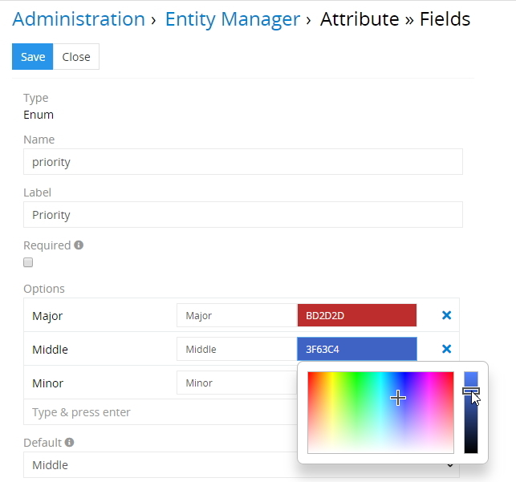
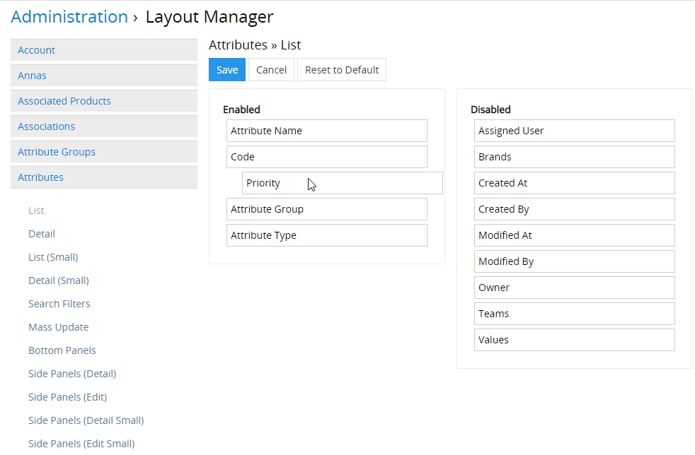
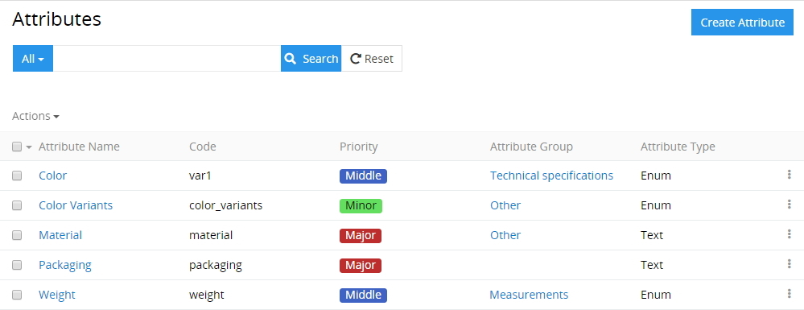
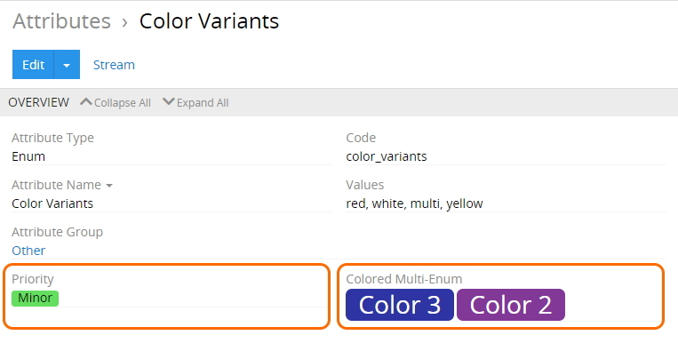

# Colored Fields

The "Colored Fields" module enables a colorful highlight of `Enum`  and `Multi-Enum`  fields values in order to attract user's attention, i.e. after the module installation, the values of all `Enum` (when only one value is available for choosing from the list) / `Multi-Enum`(when several values are available for choosing from the list) fields get a color code that can be defined by the administrator.  

Thanks to the "Colored Fields" module, the usability of the TreoCore (TreoPIM, TreoDAM, TreoCRM) interface significantly improves and becomes even more user friendly. 

## Installation Guide

To install the "Colored Fields" module to your system, go to `Administration > Module Manager`, find this module in the "Store" list and click `Install`:

Select the desired version in the installation pop-up window that appears and click the `Install` button. The module background will turn green and it will be moved to the "Installed" section of the Module Manager. Click `Run update` to confirm its installation.

Please, note that running the system update will lead to the logout of all users.

To update/remove the "Colored Fields" module from the system, use the corresponding options from its single record actions menu in `Administration > Module Manager`.

Please, note that the "Colored Fields" module can also be installed together with [TreoPIM](https://treopim.com/help/what-is-treopim) and it is PIM dependent, i.e. if PIM is still installed in the system, the "Colored Fields" module cannot be removed.

## Administrator Functions

After the "Colored Fields" module is installed, the options for a background color appear for each field value of the `Enum` / `Multi-Enum` type.

### Field Color Configuration

By default, all already existing values of the `Enum` / `Multi-Enum` fields are displayed against the gray background (#ccc). The newly created values are given the black background (#333333).

To set a different color for a field value, go to `Administration > Entity Manager` and click `Fields` for the corresponding entity:

In the new window that opens, all fields of the selected entity are displayed. Click the desired field of the `Enum` or `Multi-Enum` type or click the `Add Field` button to create a new `Enum` / `Multi-Enum` field:

The `Multilang` options are available in the fields list when the "Multi-Languages" module in installed in the system. Learn more about this module [here](https://treopim.com/store/multilanguage-and-locales).

In the fields window that opens, configure field colors for each option separately. To do this, click the color field (`333333` against the black background) to open the color picker pop-up and:

- drag the slider on the color palette (the color code is changed on the fly along the color selection);
  

or 
- enter the desired color code right in the color field (the slider on the color palette is automatically moved to the corresponding color).

#### Font Settings

When creating/editing the field of the `Enum` / `Multi-Enum` type, you can also set the font size. Enter the value in `em` relatively to the current font size in the corresponding field:

*If `1` is entered, the standard font size will be used for this field display.*

Possible values range is 0.7 – 2:

If the entered value is out of this range, the following error message appears:

Make necessary changes and click `Save` to apply your color and font configuration.

### Colored Field Display on the Layout

*Installing the "Colored Fields" module does not add any restrictions to the `Enum` / `Multi-Enum` fields in the Layout Manager, i.e. they can be used normally.*

To display the newly created field(s), go to `Administration > Layout Manager` and click the desired entity in the list to unfold the list of layouts available for this entity. Click the layout you wish to configure (e.g. `List`) and enable the created  field by its drag-and-drop from the right column to the left:

Click `Save` to complete the operation. The added colored field will be displayed on the configured layout type for the given entity:

To customize the fields display for other layout types of the entity, make similar changes to the desired layout types in the Layout Manager, as described above. 

## User Functions

After the "Colored Fields" module is installed and configured by the administrator, user can view the changes in the system interface and use background color options that are predefined by the administrator. 

In the entity detail view, the background colors are shown as follows:

In-line editing is also possible for colored `Enum` / `Multi-Enum` fields as shown below.

`Enum` field editing:

`Multi-Enum` field editing, if multiple values are selected from the previously saved list:

***Install the "Colored Fields" module now to enable setting colorful backgrounds to values from all `Enum` / `Multi-Enum` fields. This is especially useful for status fields or any other fields related to the work processes or their life cycles.***

